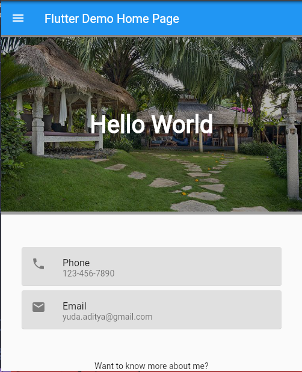
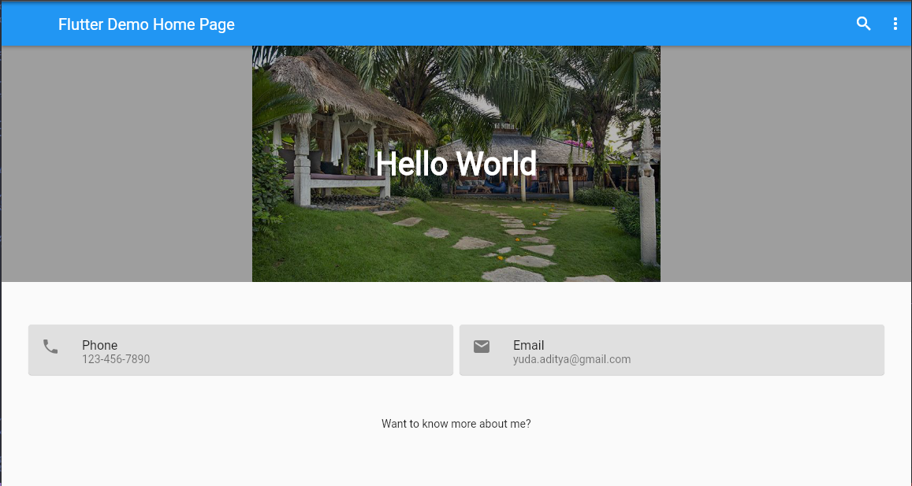
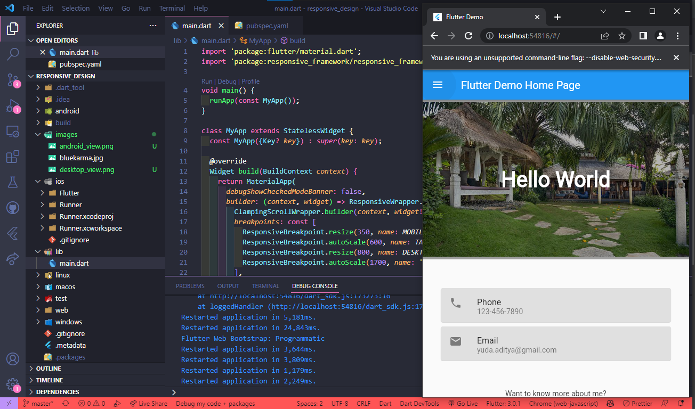

# Project responsive_design

Project ini menerapkan resposive design untuk aplikasi android ini. Resposive merupakan suatu adaptasi sebuah desain menyesuaikan dengan lebar layar suatu device yang menjalankannya. Desain responsif menyesuaikan elemen desainnya sesuai dengan lebar layar. Desain seperti ini menampilkan konten sesuai dengan ruang layarnya.

## Hasil saat Layar memiliki lebar yang kecil

## Hasil saat Layar memiliki lebar yang lebar

## Bukti Kerja

This project is a starting point for a Flutter application.

A few resources to get you started if this is your first Flutter project:

- [Lab: Write your first Flutter app](https://docs.flutter.dev/get-started/codelab)
- [Cookbook: Useful Flutter samples](https://docs.flutter.dev/cookbook)

For help getting started with Flutter development, view the
[online documentation](https://docs.flutter.dev/), which offers tutorials,
samples, guidance on mobile development, and a full API reference.
